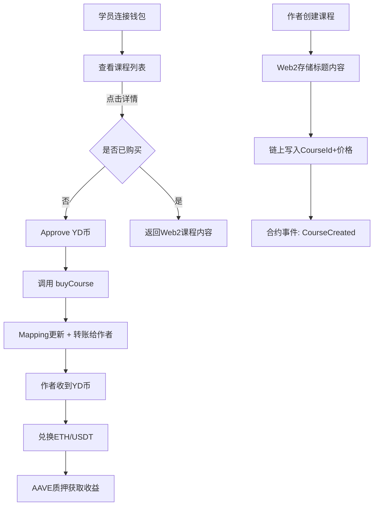

## 1. 产品背景

Web3大学旨在通过 **链上课程购买系统** 实现教育内容的去中心化支付与授权。用户可使用平台代币（YD币）购买课程，课程作者则通过YD币兑换ETH/USDT，并支持AAVE质押获取收益。

---

## 2. 功能需求

### 2.1 用户端（课程学员）

* **钱包连接**

  * 支持MetaMask或其他Web3钱包，显示ENS/地址。
* **课程列表展示**

  * 从链上合约 `mapping(courseId => userOwned)` 获取用户是否已购买。
  * 课程基本信息（标题、简介、价格）存储在Web2数据库。
* **课程详情**

  * 点击课程详情时，后端通过钱包地址校验是否购买过对应课程（链上查询）。
  * 已购买 → 返回Web2存储的课程内容。
  * 未购买 → 提示无权限。
* **课程购买**

  * 步骤1：approve （授权合约使用用户指定数量的YD币）。
  * 步骤2：调用合约 `buyCourse(courseId)` 扣除YD币，转账给课程作者，并更新链上 `mapping`。
* **代币兑换**

  * 提供 ETH ↔ YD 币兑换功能（例如 1 ETH = 4000 YD）。
  * 界面有输入兑换数量和确认兑换按钮。

---

### 2.2 作者端（课程作者）

* **课程创建**

  * 输入课程标题、内容、价格（单位：YD币）。
  * 课程详情存储在Web2（数据库/localStorage）。
  * 课程ID与作者地址存储在链上合约（mapping）。
  * 创建课程需支付Gas。
* **收入管理**

  * 购买课程所得的YD币会进入作者钱包。
  * 作者可将YD币兑换成ETH或USDT。
  * 
* **选修功能：AAVE质押**
  * 作者可将ETH/USDT存入AAVE合约。
  * 三次钱包交互（approve → supply → aToken到账）。
    * 第一次和合约交互 交 gas
    * 第二次合约确认成功
    * 第三次合约 钱包会再弹一次，合约给用户赚钱 aethusdt
  * 获得利息收益（如年化5%）。

---

### 2.3 管理与平台逻辑

* 平台可在交易中收取手续费（如2%-5%）。
* 平台通过合约控制资金流转：

  * 学员 → 合约（approve + transfer） → 作者钱包。
* 映射关系：

  * `mapping(courseId => mapping(user => bool))` 记录用户是否购买。

---

## 3. 技术方案

### 3.1 前端

* **框架**: next.js
* **钱包连接**:
  * wagmi + viem （更现代）
  * 或 ethers.js（更轻量）
* **UI**: TailwindCSS + shadcn/ui

### 3.2 后端

* **Web2部分存储课程信息**
  * NestJS + Prisma ORM + Swagger
- **部署架构**: 原生支持 AWS Lambda / Serverless

### 3.3 合约（Solidity）

* **代币合约**: ERC20 (YD Token)
* **课程合约**:

  * `createCourse(courseId, price, author)`
  * `buyCourse(courseId)`
  * `mapping(courseId => mapping(user => bool))` 购买记录
  * `event CourseCreated(courseId, author, price)`
  * `event CoursePurchased(courseId, user, price)`
* **兑换合约（可简化为Mock Swap）**

  * 实现 ETH ↔ YD 币兑换
* **AAVE交互**

  * 调用 AAVE V3 lending pool 合约（`supply()` 方法）
  * 资产获得 aToken (aETHUSDT)。

### 3.4 The Graph（可选）

* 用于链上课程购买事件的索引，前端可快速查询用户已购买课程列表。

---

## 4. 用户流程




## 6. 项目结构如下：


```
web3-university/
├─ package.json                # pnpm workspace 根配置
├─ pnpm-workspace.yaml
├─ README.md
├─ .gitignore
│
├─ apps/
│  ├─ frontend/                # 前端 Next.js 应用
│  │  ├─ app/
│  │  │  ├─ page.tsx           # 课程列表
│  │  │  ├─ course/[id]/page.tsx # 课程详情
│  │  │  ├─ author/new/page.tsx  # 创建课程
│  │  │  ├─ exchange/page.tsx    # ETH ↔ YD 兑换
│  │  │  └─ layout.tsx
│  │  ├─ data/
│  │  │  └─ courses.seed.json    # 课程元数据种子
│  │  ├─ public/
│  │  ├─ next.config.ts
│  │  ├─ tsconfig.json
│  │  ├─ .env.local.example      # NEXT_PUBLIC_CHAIN_ID / RPC / 合约地址
│  │  └─ package.json
│  ├─ backend/                 # NestJS 后端
│  └─ contracts/               # Hardhat 合约与部署
│     ├─ contracts/
│     │  ├─ YDToken.sol         # ERC20(YD)
│     │  ├─ Courses.sol         # 课程创建/购买/手续费
│     │  └─ MockSwap.sol        # 固定汇率 ETH ↔ YD
│     ├─ scripts/
│     │  ├─ deploy.ts           # 部署合约并初始化
│     │  └─ export-abi.ts       # 导出 ABI+地址 到 exports/
│     ├─ exports/
│     │  └─ <chainId>.json      # { addresses, abis } 供前端/后端引用
│     ├─ hardhat.config.ts
│     ├─ package.json
│     └─ test/
│
├─ packages/
│  ├─ ui/                      # UI 组件库
│  ├─ lib/                     # 非 UI 业务/链上工具库
│
└─ subgraph/                   # 可选：The Graph 子图
   ├─ schema.graphql
   ├─ subgraph.yaml
   ├─ src/mapping.ts
   └─ package.json

```


## 7. 选修功能：AAVE 质押实施方案（草案）

目标：为课程作者提供将资产（优先 ETH，其次 USDT）存入 AAVE V3 获得利息的能力，支持存入、提取、余额与收益展示，最小改动接入现有代码结构（apps/contracts/exports 提供 ABI+地址，前端直接读写）。

### 7.1 方案选型

- 直接接入（推荐，首期）：前端直接与 AAVE V3 合约交互，aToken 直接发到作者钱包。
  - ETH 通过 WETHGateway `depositETH/withdrawETH`（免 approve）。
  - USDT/USDC 通过 Pool `supply/withdraw`（需要 approve 给 Pool）。
- 适配器合约（可选，二期）：新增 `AaveAdapter.sol` 封装 `supply/withdraw`，便于未来做费率抽成、白名单或额度管理；首期为降复杂度可不做。

### 7.2 链与资产策略

- 本地开发：两条路径二选一
  - Hardhat mainnet fork（推荐，真实 AAVE 地址、WETH/USDT 逻辑一致）。
  - 纯本地：提供 `MockAavePool.sol` + `MockAToken.sol` 进行最小验证（不计真实利息）。
- 测试网/主网：优先支持 Sepolia/Arbitrum/主网其中之一（以团队可用 RPC 为准）。
- 资产优先级：
  - M1：ETH（WETH）
  - M2：USDT（6 位小数，注意 approve 与单位换算）

### 7.3 合约与导出

- 新增接口（不一定部署，仅供编译/类型）：
  - `interfaces/aave/IPool.sol`（`supply`, `withdraw`, `getUserAccountData`）
  - `interfaces/aave/IWETHGateway.sol`（`depositETH`, `withdrawETH`）
- （可选）新增 `AaveAdapter.sol`：
  - `depositEth()` → 调用 `WETHGateway.depositETH(pool, msg.sender)`
  - `depositErc20(address asset, uint256 amount)` → 需持币人先 `approve` 给 Adapter，再 Adapter `supply` 到 Pool，`onBehalfOf = msg.sender`
  - `withdraw(address asset, uint256 amount)`
  - 使用 `ReentrancyGuard` + `SafeERC20`，清零式授权
- 部署脚本：
  - 不部署 AAVE 合约本体，只在 `apps/contracts/exports/<chainId>.json` 中维护 AAVE 相关地址
  - 若使用 Adapter，则部署 Adapter 并一并导出地址
- `export-abi`：
  - 导出 `IPool`, `IWETHGateway`,（可选 `AaveAdapter`） ABI 到 `apps/contracts/exports`，供 `packages/lib/src/contracts.ts` 使用

### 7.4 前端页面与交互

- 路由：`/author/stake`（作者质押面板）
- 功能模块：
  - 资产选择：`ETH`（优先）、`USDT`（二期）
  - 余额展示：钱包原生余额 + aToken 余额
  - 年化/APY：调用 AAVE Data Provider 或临时文案（若无可用 RPC，再接入）
  - 存入流程：
    - ETH：直接调用 `WETHGateway.depositETH(pool, onBehalfOf=user, referralCode=0)`，value=输入的 ETH
    - USDT：先 `approve(Pool, amount)` → `Pool.supply(USDT, amount, onBehalfOf=user, 0)`
  - 提取流程：
    - ETH：`WETHGateway.withdrawETH(pool, amount, to=user)`
    - USDT：`Pool.withdraw(USDT, amount, to=user)`
  - 交易状态：沿用 `useTxStatus`，提示网络不匹配、余额不足、授权缺失
- 配置：
  - 在 `apps/frontend/.env.local` 增加
    - `NEXT_PUBLIC_AAVE_POOL`、`NEXT_PUBLIC_WETH_GATEWAY`
    - `NEXT_PUBLIC_WETH`、`NEXT_PUBLIC_AWETH`
    - （二期）`NEXT_PUBLIC_USDT`、`NEXT_PUBLIC_AUSDT`
  - `packages/lib/src/contracts.ts` 读取 `apps/contracts/exports/<chainId>.json` 中的地址（保持与现有模式一致）

### 7.5 本地与测试

- Mainnet fork（推荐）：
  - 在 `apps/contracts/hardhat.config.ts` 增加 forking 配置（需 Alchemy/Infura KEY）
  - Hardhat 任务：`pnpm --filter @web3-university/contracts hardhat node --network hardhat`
- 纯本地（无 fork）：
  - 新增 `MockAavePool` 与 `MockAToken`，在 `deploy.ts` 中一并部署并导出地址供前端连通性验证
- 合约测试（若做 Adapter）：
  - fork 环境下覆盖 `depositEth/depositErc20/withdraw` 正常路径与异常（余额不足、未授权、reentrancy 防护）

### 7.6 验收标准（M1：ETH 版本）

- 前端可在 `/author/stake`：
  - 看到钱包 ETH 余额与 aWETH 余额
  - 能输入金额并成功存入（交易成功，aWETH 余额增加）
  - 能成功提取（aWETH 余额减少，ETH 余额增加）
  - 异常提示友好：余额不足、网络不匹配、未连接钱包、金额无效
- 配置清晰：不同网络地址来自 `apps/contracts/exports/<chainId>.json` 或 `.env.local`
- 不引入 Breaking Change：课程创建/购买、兑换流程不受影响

### 7.7 风险与注意事项

- USDT 小数位为 6，金额换算谨慎处理（`parseUnits(x, 6)`）
- 授权建议“所需即用”，并支持用户手动减少授权（approve 到 0 再设新值）
- 仅做存取与收益展示，不启用抵押/借贷（避免复杂度与风险）
- 避免将用户资产转入平台托管；默认 onBehalfOf=用户地址，aToken 直接归用户
- 真实 APY 读取依赖 Data Provider 与可用 RPC，若无则先提供静态文案/占位

### 7.8 里程碑

- M1（首周）：ETH 存入/提取（WETHGateway 直连），mainnet fork 验证，最小 UI
- M2（次周）：USDT 接入（approve+supply），UI 切换资产，显示 aToken 余额
- M3（择机）：接入 Data Provider 展示 APY，测试网/主网地址配置与文档沉淀

### 7.9 待确认问题

- 优先支持的测试网与资产清单？（Sepolia/Arbitrum/主网；ETH/USDT/USDC）
- 是否需要平台抽成或额外的“质押奖励”逻辑？（若需要需引入 Adapter）
- 团队可用的 RPC 与 forking 方案？

确定无误后，我将按以上 M1 范围落地实现，并在 contracts 与 web 分别提交最小可用改动。

---

## 5. 技术栈总结

* **智能合约**: Solidity + Hardhat
* **代币标准**: ERC20 (hewei币)
* **链上交互**: wagmi/viem 或 ethers.js 
* **前端**: Next.js , 需要使用next.js 的cli 来初始化项目，使用pnpm来进行包管理
* **DeFi对接**: AAVE V3 合约

---
